# 「千人百村」数智渔韵实践队：九村调研+六产考察，北印学子深耕马昌营镇乡村振兴

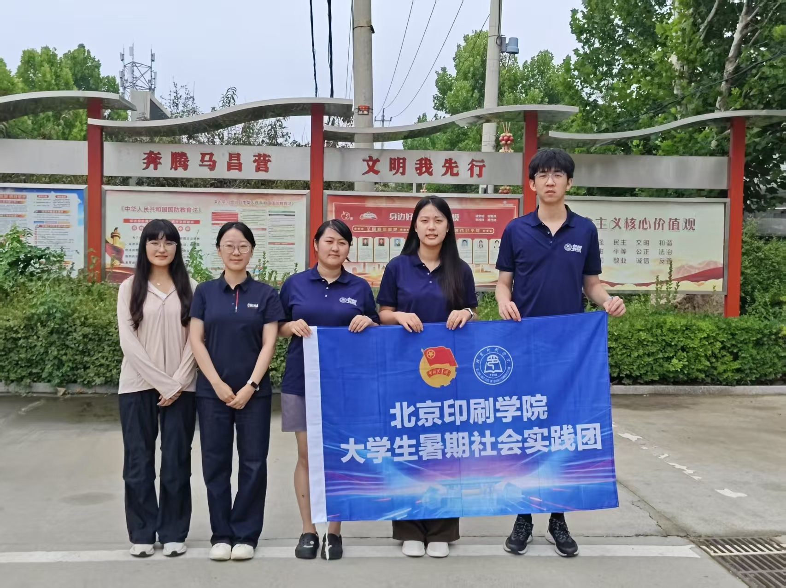

7月中旬，北京印刷学院智能科学与技术专业"数智渔韵"实践队深入平谷区马昌营镇，依托"千人百村"大学生暑期社会实践平台，围绕渔业产业转型、特色产业发展、非遗文化传承、生态保护等核心议题，对全镇9个渔业村庄和6个特色产业点开展了为期数周的密集调研。团队以智能科学的专业视角审视传统渔业痛点，用数据和科技思维为乡村振兴建言献策，在基层实践中受教育、长才干、作贡献。

## 一、团队介绍：三人小队，各司其职

实践队由3名智能科学与技术专业学生组成，徐长波副院长和蒋祎辅导员担任指导教师。

队长**石宇含**负责统筹组织、实地访谈及成果完善，承担村委会对接、行程排布、团队协调等核心工作，同时参与搭建信息可视化网站。**范潇麟**负责全程影像记录、视频剪辑与报告撰写，累计拍摄照片200余张、录制视频60余条，独立完成实践宣传视频剪辑。**高靖昆**全程参与实地走访、现场拍摄及基础资料收集整理，为整体调研工作平稳推进提供有效助力。

## 二、九村鱼塘踏勘：全面摸底渔业产业实情

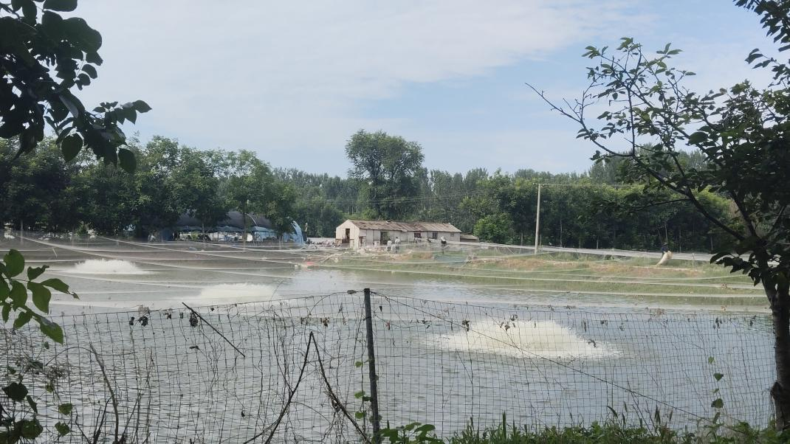

实践队先后深入北定福村、东双营村、天井村、马昌营村、王各庄村、后芮营村、前芮营村、西海子村、东陈各庄村，通过塘口实地踏勘、入户走访养殖户、座谈村"两委"等方式，全面摸排全镇渔业养殖产业发展实情。

调研发现，马昌营镇渔业养殖历史悠久，全镇养殖面积约千余亩，养殖品种涵盖鲤鱼、草鱼、鲫鱼、鲢鱼、鳙鱼、罗非鱼等十余个品类，年产值达数千万元。然而，各村庄在养殖模式、智能化水平、销售渠道等方面差异显著，产业发展面临多重挑战。

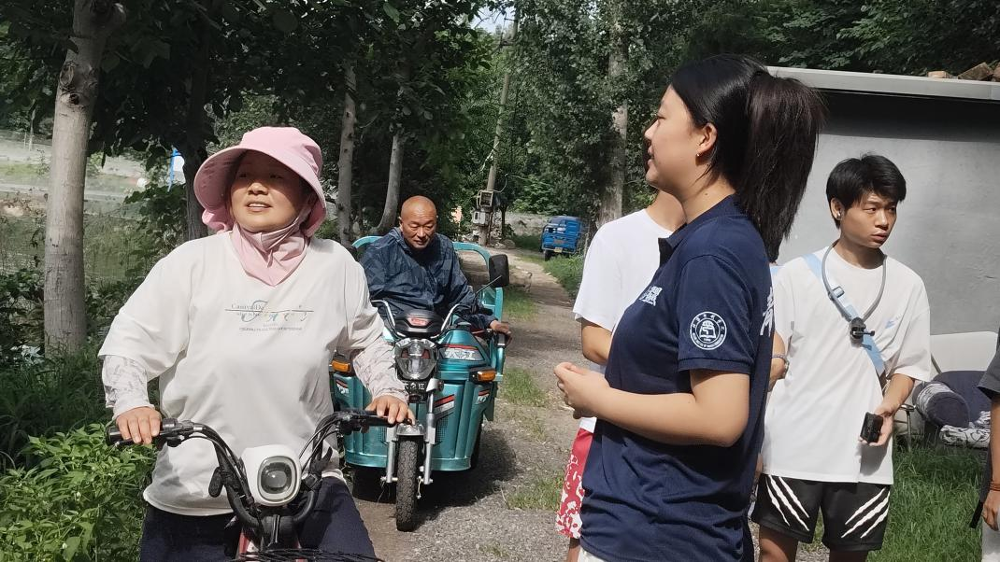

**东双营村**的案例引发了团队对"智能化≠高效益"的深思。一位渔民投入近200万元购置自动投饵系统、水质监测设备、增氧系统等智能设备，控制室内显示屏实时显示水温、溶氧量等参数。然而，设备折旧和维护成本高企，养殖品种和销售模式并未同步升级，整体收益并不理想。这一案例表明，智能化设备的选择必须与养殖场实际规模和经营能力相匹配，盲目追求高端设备可能适得其反。

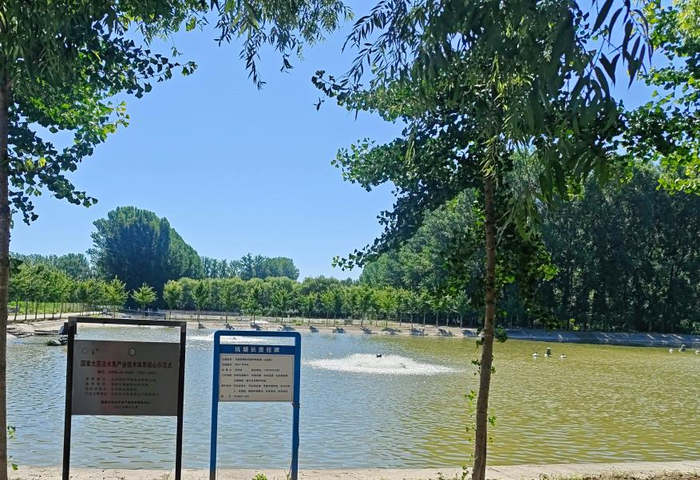

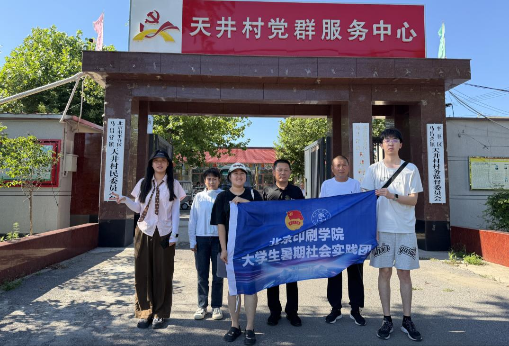

**天井村**的养殖户则走出了一条不同的路。该村约有五六户从事水产养殖，总养殖面积约百十亩。一位渔民将尾水排入旁边的藕塘，利用藕塘对养殖废水进行自然净化和循环利用，虽然尚未形成完整的鱼菜共生系统，但为生态养殖探索了简单易行的路径。在销售方面，该渔民通过微信等线上方式直接对接客户，减少了中间环节，收益相对更好。

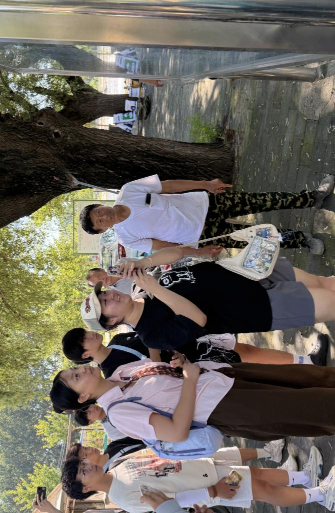

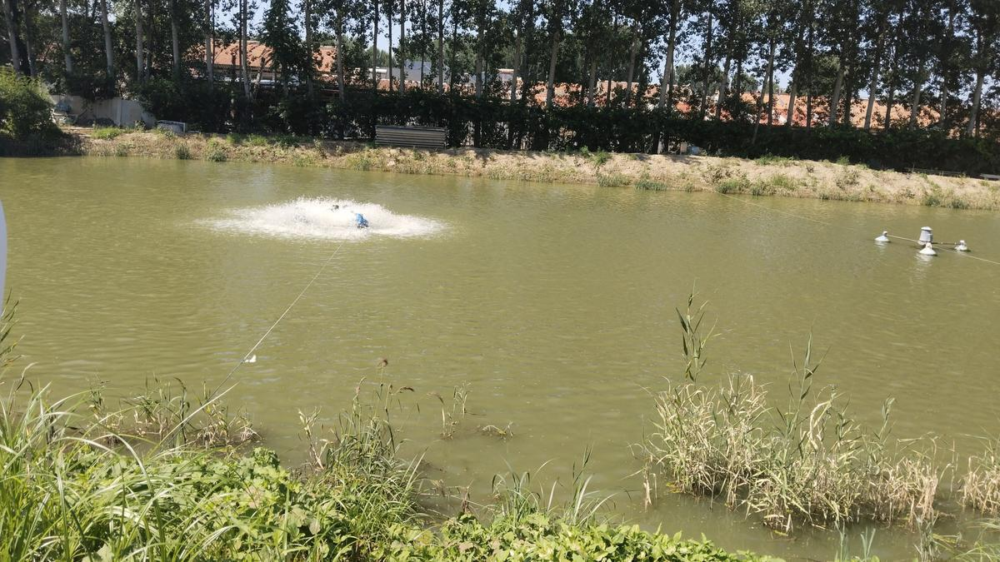

**后芮营村**的鱼菜共生示范基地是全镇智能化程度最高的养殖项目。基地配备完整的循环水处理系统、实时水质监测系统、自动投饵系统、智能温控系统等，实现了从水质管理到投喂管理的全流程智能化控制。基地创新打造"尾水净化—林地灌溉"生态循环模式，实现渔林共生、绿色发展，年产水产可达100吨。同时，基地设立水产病害防治服务站点，免费为周边养殖户提供鱼苗供应、鱼病诊疗、养殖技术指导等服务，成为联农带富的示范样本。

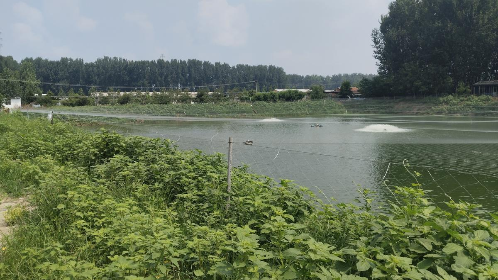

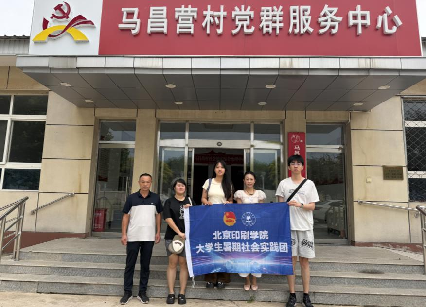

**马昌营村**作为全镇最大的渔业养殖村，全村约25户从事水产养殖，养殖面积约350亩，品种覆盖几乎全部北京地区淡水养殖主流品类。然而，全村95%以上的水产品依赖鱼贩上门收购，养殖户对市场价格几乎没有话语权。

**西海子村**拥有规模化观赏鱼养殖基础，锦鲤和金鱼养殖利润率可观，但品种培育周期长、市场价格波动大、病害风险高。**前芮营村**探索"养殖+垂钓"复合经营模式，为传统渔业注入新活力。**东陈各庄村**推进鱼光互补项目，在鱼塘上方架设光伏板，实现"上可发电、下可养鱼"，但夏季极端天气易引发鱼类死亡。**北定福村**和**王各庄村**的养殖户设备简陋，主要依靠人工经验管理，面临资金和设备条件制约。

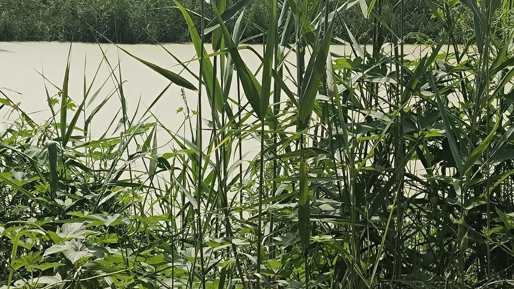

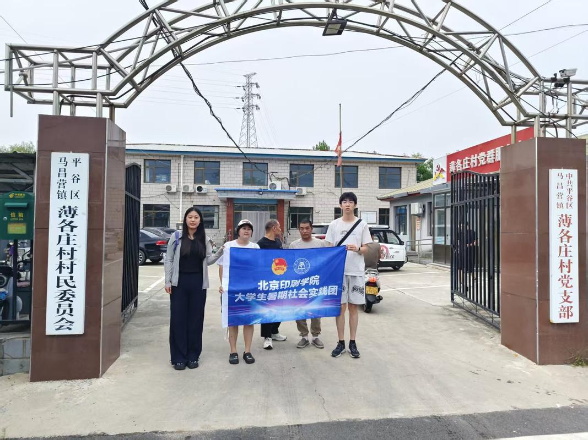

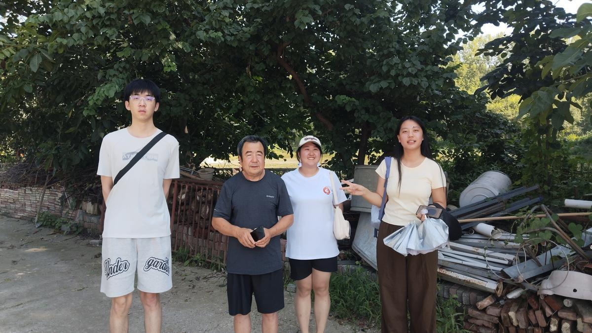

## 三、特色产业考察：六产联动，多元发展

除渔业养殖外，马昌营镇还发展了多个特色产业和文化活动项目。实践队重点考察了宠物产业园、又见咖啡、非遗活动、物流中心、首爱活动和首创环保等六个特色产业点。

### 宠物产业园：打造"宠物经济"新引擎

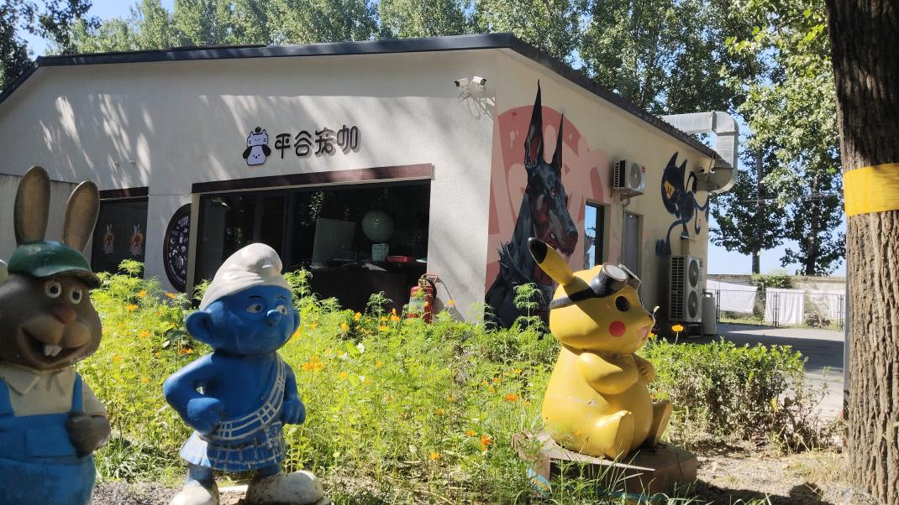

马昌营镇宠物产业园占地面积约50亩，目前已吸引多家宠物用品生产企业和宠物服务企业入驻，涵盖宠物食品加工、宠物用品制造、宠物美容培训、宠物医疗保健等多个业态。园区内建有标准化生产车间、仓储物流中心、产品展示厅和宠物体验互动区。产业园负责人介绍，未来将进一步扩大园区规模，引入宠物医疗、宠物寄养、宠物摄影等更多服务业态，同时加强与周边渔业养殖的产业联动——例如将养殖场的低值小鱼加工为宠物食品原料，实现产业链延伸和价值提升。

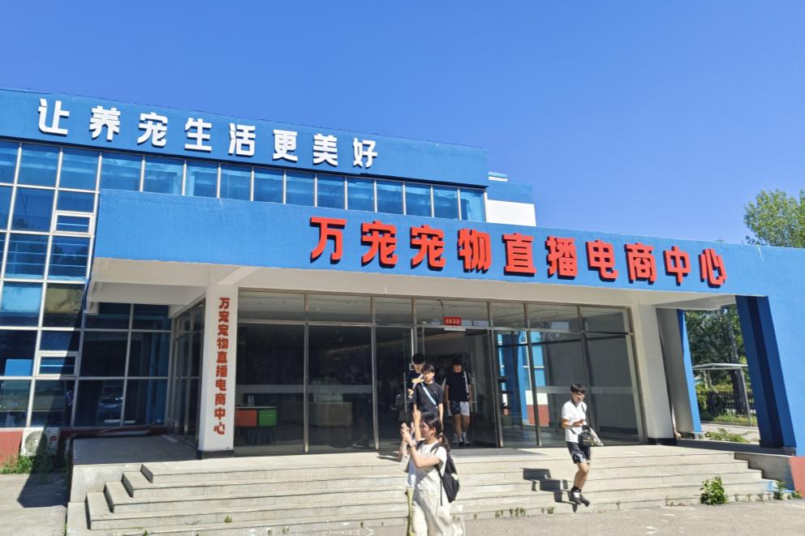

### 又见咖啡：乡村文创的探索实践

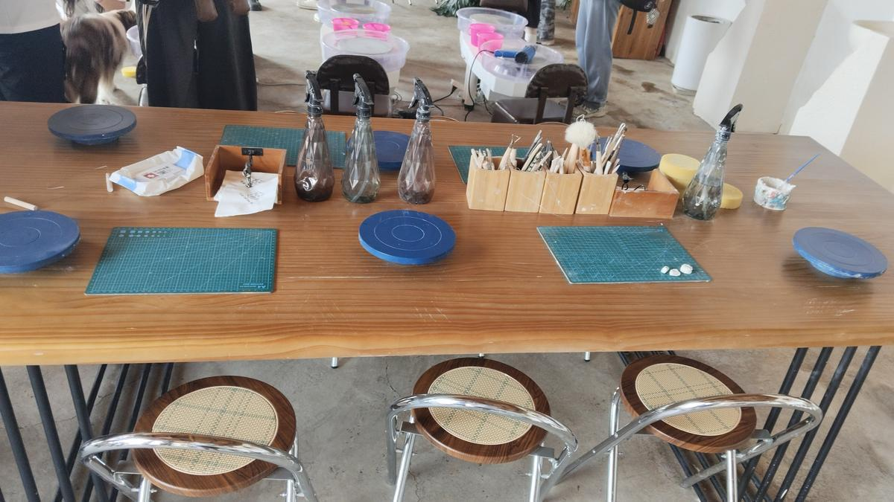

"又见咖啡"是由返乡创业年轻人经营的乡村主题咖啡馆，将当地传统的盆窑文化与现代咖啡文化相结合，打造独特的乡村文创空间。店内展示和销售当地手工艺品，定期举办手作体验活动，同时是一个宠物友好空间。负责人坦言，目前咖啡馆仍在探索稳定的盈利模式，客流量受季节和天气影响较大。这表明乡村文创产业前景广阔，但也面临市场培育、客流不稳定等现实挑战。

### 非遗活动：掐丝珐琅的匠心温度

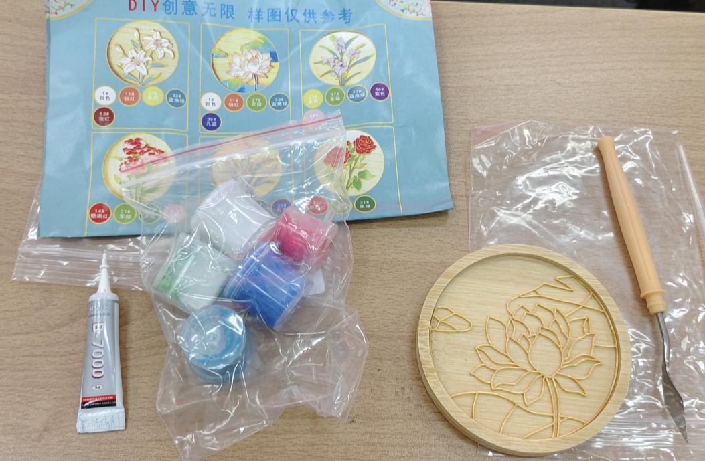

实践队参加了在镇文化中心举办的非遗掐丝珐琅杯垫制作活动。在专业老师的指导下，队员们逐一体验裁丝、掐丝、点蓝、固色等核心工序，将一根根细铜丝掐成精美图案，再小心翼翼地填入各色珐琅釉料。整个过程需要极大的耐心和细致的手工技巧，经过数小时的努力，一件件色彩鲜艳、独具特色的掐丝珐琅杯垫逐渐成型。此次非遗体验让团队成员深刻认识到非遗传承的重要性和紧迫性，团队建议可将掐丝珐琅等非遗技艺与渔业文化相结合，开发具有地方特色的文创产品。

### 物流中心：冷链物流打通"最后一公里"

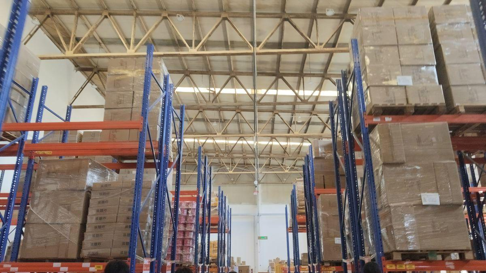

马昌营镇物流中心占地面积约30亩，建有标准化仓库5000平方米、分拣中心2000平方米、冷藏库1000平方米，入驻物流企业5家，日均货物吞吐量约200吨。负责人特别介绍了为当地水产品量身定制的冷链物流解决方案——"以前养殖户卖鱼，都是鱼贩开着三轮车来拉，鱼在运输过程中的死亡率很高。现在有了冷链物流，活鱼可以装在充氧的专用运输箱里，通过冷链网络直接送到城区的餐饮店和超市，成活率能提高到95%以上。"冷链物流的推出，有效解决了活鱼运输死亡率高的老大难问题，为养殖户拓展远程销售市场创造了条件。

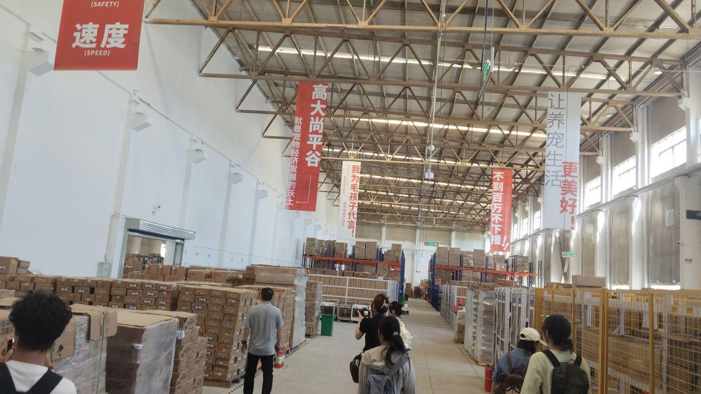

### 首爱活动：人宠和谐的温暖实践

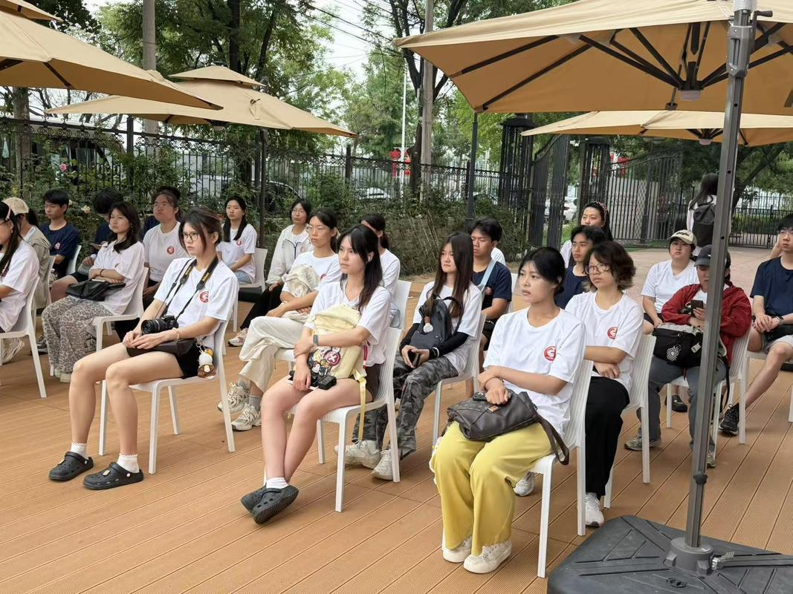

"首爱"是马昌营镇与首都爱护动物协会合作开展的公益活动。活动现场，老师为大家讲解了如何正确抚慰猫和狗，介绍了与宠物互动的注意事项和技巧。

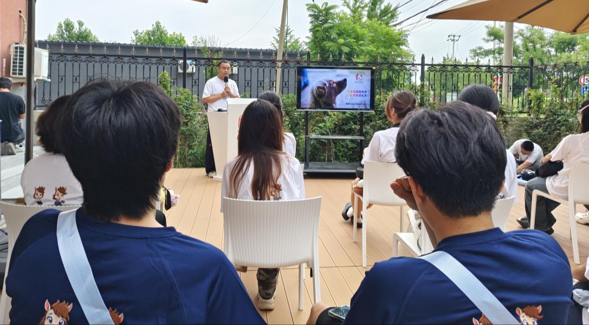

在老师的引导下，团队成员近距离接触了一些性格温顺的流浪猫狗，亲手抚摸并与它们互动，感受人与动物之间的温暖连接。老师还向大家普及了动物保护的相关知识，呼吁关注流浪动物救助、科学文明养宠等理念。团队认为，可将"首爱"活动与宠物产业园、乡村旅游等元素结合，打造马昌营镇"宠物友好"的特色名片。

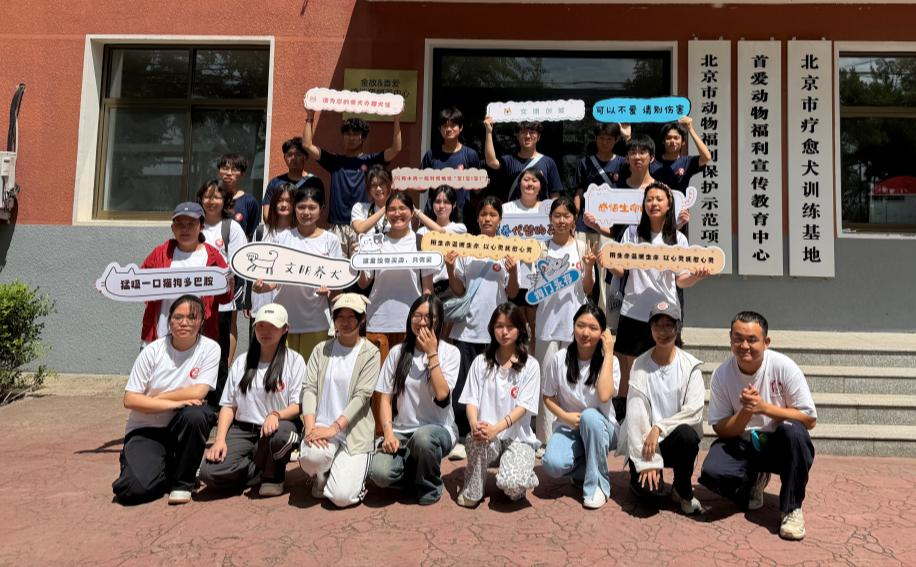

### 首创环保：全域土地综合整治规划

首创环保团队向实践队介绍了马昌营镇全域土地综合整治策划方案。该方案对全镇土地资源进行系统规划和综合利用，统筹考虑农业用地、建设用地、生态用地等不同功能板块的协调布局。方案涉及对现有养殖区域的优化调整、对闲置土地的盘活利用、对乡村人居环境的提升改造等内容，是马昌营镇未来发展的重要指导性文件。

---

**文字：** "数智渔韵"实践队 范潇麟
**图片：** "数智渔韵"实践队
**指导教师：** 徐长波、蒋祎
